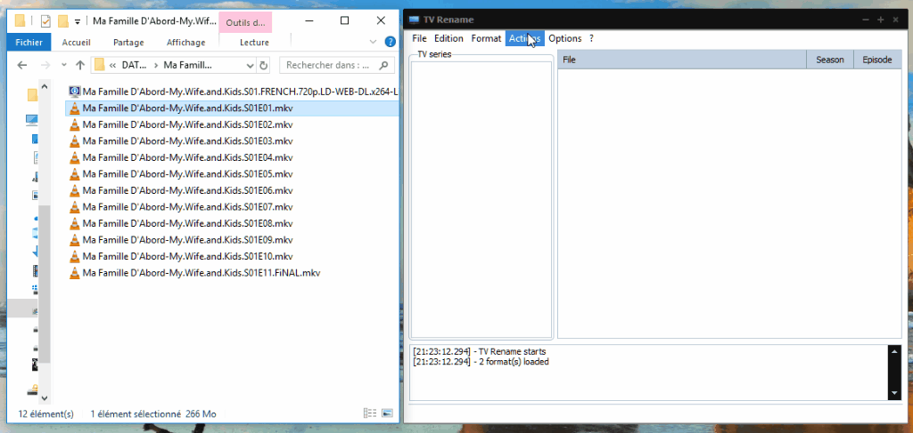

# tv_rename

  <!-- Stability -->
  
  <!-- Standard -->
  

 

A tool to rename your favorites TV shows collection !

Written with Delphi for Windows XP, fixed for recent Windows.

But still using a very unreliable but working method to scrap series information :smile:

Date: around 2010

 

## Example

  

